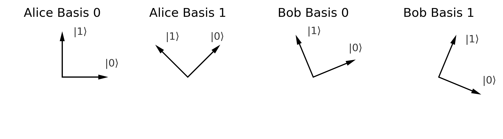
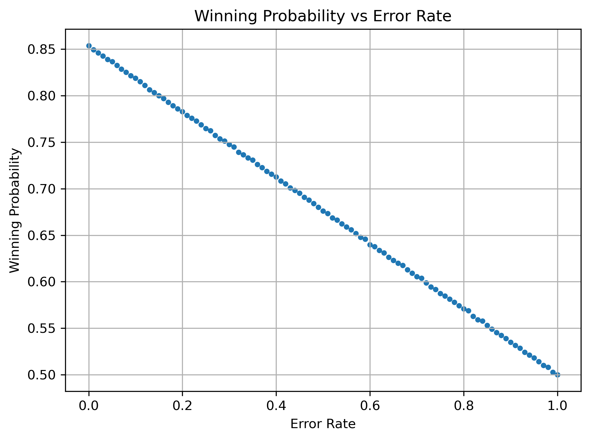

# Investigation of Quantum Strategies for CHSH Game and Noisy Quantum States

---

*Changyu Yao*

## Introduction

### 1. CHSH Game

The Clauser-Horne-Shimony-Holt (CHSH) game is a fundamental framework in quantum information theory, used to explore the nonlocal properties of quantum mechanics. It is a two-player cooperative game where the players, typically named Alice and Bob, aim to maximize their winning probability by leveraging shared quantum entanglement.

##### Game Setup

The CHSH game involves:

1. Two separate players (Alice and Bob) who cannot communicate during the game.
2. A referee who provides each player with a random input, denoted as `x` and `y`, from a set of two possible values, `0` and `1`.
3. Each player responds with a binary output: `a` for Alice and `b` for Bob.
4. The goal is to make a game strategy beforehand to **maximize** the probability of satisfying the following condition:

$$
a \oplus b = x \times y
$$

where $\oplus$ denotes the XOR operator, or effectively, addition modulo 2.

##### Classical Limit

The truthtable for the CHSH game is:

| x, y \ a, b | 00   | 01   | 10   | 11   |
| ----------- | ---- | ---- | ---- | ---- |
| 00          | win  | lose | lose | win  |
| 01          | win  | lose | lose | win  |
| 10          | win  | lose | lose | win  |
| 11          | lose | win  | win  | lose |

From this truthtable, we can see that, if they randomly choose their input, Alice and Bob will have a winning probability of $8/16 = 50\%$. However, if they decide to give the same return values, for example, both Alice and Bob always output `0`, then their winning probability will be $3/4 = 75\%$. One can prove that in classical strategy, $75\%$ is the maximum possible winning probability.

### 2. Two-qubit Quantum States and Quantum Measurements

##### Quantum States

The dimension of the Hilbert space of two-qubit quantum states is $2\times 2 = 4$. The standard basis states of this space are:

- $|00\rangle = |0\rangle_A \otimes |0\rangle_B$
- $|01\rangle = |0\rangle_A \otimes |1\rangle_B$
- $|10\rangle = |1\rangle_A \otimes |0\rangle_B$
- $|11\rangle = |1\rangle_A \otimes |1\rangle_B$

Any pure quantum state can be expressed as a linear combination of these basis states. More generally, quantum states can be described using **density matricies**, which can represent both pure and mixed states. For a two-qubit system, the density matrix is a $4\times 4$ Hermitian, positive semidefinite matrix with trace equal to 1.

A pure state $|\Psi\rangle$ is represented by the density matrix:

$$
\rho = |\Psi\rangle \langle\Psi|
$$

and a mixed state can be decomposed into a weighted sum of pure states, where the weights are given by a normalized probability distribution.

##### Quantum Measurements

When Alice measures her qubit and obtains the state $|\Psi\rangle_A$, qubit `A` collapses to the measured result state. This process effectively applies a projection operator to the original quantum state , yielding:

$$
\rho_{\text{new}} \propto \rho P
$$

where $P$ is the projection operator corresponding to the measured result:

$$
P = \left( |\Psi\rangle \langle\Psi| \right)_A \otimes I_B
$$

***Probability of Measurement***

The probability of measuring the result state $|\Psi\rangle_A$ calculated as the trace of the operator product:

$$
p_{|\Psi\rangle_A} = \text{Tr}(\rho P)
$$

***Post-Measurement State***

The normalized quantum state of the system after the measurement is given by:

$$
\rho_{\text{new}} = (\rho P) / p_{|\Psi\rangle_A}
$$

***Disentanglement and Subsystem***

Since the measurement disentangles qubit `A` from the system, the new state can be written as:

$$
\rho_{\text{new}} = \left(|\Psi\rangle \langle\Psi|\right)_A \otimes \rho_B
$$

The density matrix for subsystem (in this case, qubit `B`) can be obtained by taking the partial trace over subsystem, given by:

$$
\rho_B = \text{Tr}_A(\rho_{\text{new}}) = \langle 0 |_A \, \rho_{\text{new}} \, |0\rangle_A + \langle 1 |_A \, \rho_{\text{new}} \, |1\rangle_A
$$

This operation reduces the composite system's density matrix to that of subsystem, reflecting the state of the subsystem after the measurement of qubit `A`.

### 3. Noisy Quantum Channels

In practical quantum systems, quantum states cannot be prepared and distributed with perfect accuracy. These imperfections can be modeled using **noisy quantum channels**. A straightforward model is the **depolarizing channel**, which involves mixing the input state with a maximally mixed state. Mathematically, this is expressed as:

$$
P_{\text{err}}(\rho) = \frac{\text{err}}{2^n} I + (1 - \text{err}) \rho
$$

Here:

- $n$ is the number of qubits in the system.
- $\text{err}$ represents the probability of an error occurring.

## Quantum Strategies for CHSH Game

Suppose Alice and Bob share an entangled state 

$$
|\Psi\rangle = \frac{|00\rangle + |11\rangle}{\sqrt{2}}
$$

and both measure their qubits using the `Z` basis. If Alice measures and gets `0`, the state collapses to $|00\rangle$, and Bob will also get `0` with 100\% certainty. Similarly, if Alice measures and gets `1`, Bob will also get `1`. This is equivalent to the "same output" classical strategy, which achieves the maximum possible winning probability for classical strategies.

However, by carefully designing the measurement strategy, we can implement a quantum strategy that outperforms the classical one. For clarity, we define the quantum state:

$$
|\theta\rangle = \cos\theta |0\rangle + \sin\theta |1\rangle
$$

and the measurement basis 

$$
\mathbf{B}(\theta) = \{ |\theta\rangle, |\theta + \pi/2\rangle \}.
$$

In the quantum strategy, if Alice receives `0` from the referee, she measures her qubit in the $\mathbf{B}(\theta_{A,0})$ basis. If she receives `1`, she measures her qubit in the $\mathbf{B}(\theta_{A,1})$ basis. Bob follows a similar procedure. The strategy above is the case with $\theta_{A,0} = \theta_{A,1} = \theta_{B,0} = \theta_{B,1} = 0$.

Since only the angle difference matters, we can always choose $\theta_{A,0} = 0$, i.e., the `Z` basis. If $\theta_{A,1} = \pi/4$, $\theta_{B,0} = \pi/8$, and $\theta_{B,1} = -\pi/8$, the bases are shown in the figure below:

<div style="display: flex; justify-content: center">
  
</div>

From this figure, we can see:

- If Alice and Bob both receive `0`, they need to give the same output, with a winning probability of $\cos^2(\pi/8) \approx 0.85$.
- If Alice receives `0` and Bob receives `1`, they need to give the same output, with a winning probability of $\cos^2(\pi/8) \approx 0.85$.
- If Alice receives `1` and Bob receives `0`, they need to give the same output, with a winning probability of $\cos^2(-\pi/8) \approx 0.85$.
- If Alice and Bob both receive `1`, they need to give different outputs, with a winning probability of $\cos^2(-\pi/8) \approx 0.85$.

Therefore, for every possible input combination, we achieve a winning probability of $\cos^2(\pi/8) \approx 0.85$. Thus, the overall winning probability is also $0.85$, which is higher than the classical limit of $0.75$. In fact, this represents the optimal basis choice for a quantum strategy.

## Implementation

We will implement the quantum strategy in C++ for better performance and export the module as a Python module for ease of use. 

- The source code for the CHSH simulation is located in `State.h` and `CHSH.cpp`.
- The Python module is named `CHSH.pyd`, and its interface is defined in `CHSH.pyi`.
- `simulation.py` and `plot.py` are used to run simulations and plot the results.

### 1. State Preparation with Noise

For a quantum state, we use a boolean variable `bit` to mark whether the system is still a two-qubit system and use `data` of size 16 or 4 to represent the density matrix for two-qubit or single-qubit systems, respectively. The initial state with noise strength `err` is:

$$
\begin{align*}
\rho & = \frac{\text{err}}{4}I + (1 - \text{err}) |\Psi\rangle \langle\Psi| \\
     & = \frac{\text{err}}{4} \begin{pmatrix}
         1 & 0 & 0 & 0 \\
         0 & 1 & 0 & 0 \\
         0 & 0 & 1 & 0 \\
         0 & 0 & 0 & 1
     \end{pmatrix} 
     + \frac{1 - \text{err}}{2} \begin{pmatrix}
         1 & 0 & 0 & 1 \\
         0 & 0 & 0 & 0 \\
         0 & 0 & 0 & 0 \\
         1 & 0 & 0 & 1
     \end{pmatrix}.
\end{align*}
$$

and the initial state is always a two-qubit system.

This initialization is handled by the constructor of the `State` class, which takes the error rate `err` as an input:

```cpp
State(double err);
```

### 2. Measurement of One Qubit in a Two-Qubit System

When measuring one qubit in a two-qubit system, the resulting state becomes a one-qubit system. Thus, we set `bit` to `false` and compute the 4-element (2x2) density matrix for `data`.

Given the measurement basis $\mathbf{B}(\theta)$, the probability of obtaining the result `0` is:

$$
\begin{align*}
p(\theta) &= \text{Tr}[\rho P(\theta)] \\
          &= \text{Tr}\left[\rho \cdot \left(|\theta\rangle \langle\theta|_A \otimes I_B\right)\right] \\
          &= \text{Tr}\left[\rho \cdot \left(\begin{pmatrix}
              \cos^2(\theta) & \sin(\theta)\cos(\theta) \\
              \sin(\theta)\cos(\theta) & \sin^2(\theta)
          \end{pmatrix} \otimes \begin{pmatrix}
              1 & 0 \\
              0 & 1
          \end{pmatrix}\right)\right].
\end{align*}
$$

We then compare this probability with a random number `uniform`, chosen uniformly from the interval $(0, 1)$. If `uniform` is less than the probability $p(\theta)$, the result is `0`, and the state collapses accordingly:

$$
\rho_{\text{new}} = \frac{\text{Tr}_A[\rho P(\theta)]}{p(\theta)}
$$

Otherwise, the result is `1`, and the state after measurement is:

$$
\rho_{\text{new}} = \frac{\text{Tr}_A[\rho P(\theta + \pi/2)]}{1 - p(\theta)}
$$

This behavior is implemented in the `Measure` method of the `State` class when the internal `bit` variable is `true`. The method takes the basis angle `theta` and the random number `uniform` as inputs:

```cpp
bool Measure(double theta, double uniform) {
  if (bit) {
    // ... implementation
  }
}
```

### 3. Measurement of the Remaining Qubit

This step is similar to the previous one, but we do not need to consider the state after the measurement. Given the measurement basis $\mathbf{B}(\theta)$, the probability of obtaining the result `0` is:

$$
\begin{align*}
p(\theta) &= \text{Tr}[\rho P(\theta)] \\
          &= \text{Tr}\left[\rho \cdot |\theta\rangle \langle\theta|\right] \\
          &= \text{Tr}\left[\rho \cdot \begin{pmatrix}
              \cos^2(\theta) & \sin(\theta)\cos(\theta) \\
              \sin(\theta)\cos(\theta) & \sin^2(\theta)
          \end{pmatrix} \right]
\end{align*}
$$

We then compare this probability with a random number `uniform`. If `uniform` is less than $p(\theta)$, the result is `0`; otherwise, the result is `1`.

This behavior is implemented in the `Measure` method of the `State` class when the internal `bit` variable is `false`.

### 4. Quantum CHSH Game Simulation

The function `PlayQuantum` in `CHSH.cpp` implements the quantum CHSH game simulation. Since the game involves stochastic outcomes, it is necessary to repeat the game multiple times to obtain more accurate results. The quantum strategy requires three angles to define the measurement basis. These angles are represented as:

- $\theta_{A,1}$: `diff_a`
- $\theta_{B,0}$: `diff_0`
- $\theta_{B,1} - \theta_{B,0}$: `diff_b`

The function takes the following inputs:
- `n`: Number of times to repeat the game.
- `err`: The error rate.
- `diff_a`, `diff_0`, `diff_b`: The angles defining the quantum measurement strategy.
- `Alice_first` (optional): Specifies whether Alice measures the first qubit (default is `true`).

The function signature is as follows:

```cpp
std::vector<Game> PlayQuantum(int n, double err, double diff_a, double diff_0, double diff_b, bool Alice_first = true);
```

The classical and pure random strategies are straightforward to implement; therefore, they are not discussed here. Both strategies are also implemented in `CHSH.cpp`.

## Results

### 1. Comparison Between Strategies

Here, we compare several strategies mentioned in the previous section.

***Pure Random Strategy***

The pure random strategy always outputs `0` or `1` with equal probability. The simulated game result is shown below:

```plain text
Pure Random
Winning rate with x = 0 and y = 0: 0.500348( 62514 / 124941 )
Winning rate with x = 0 and y = 1: 0.499821( 62774 / 125593 )
Winning rate with x = 1 and y = 0: 0.501683( 62450 / 124481 )
Winning rate with x = 1 and y = 1: 0.50166( 62700 / 124985 )
Overall winning rate: 0.500876( 250438 / 500000 )
```

The results show that the winning rate is $0.5$ regardless of the input values, resulting in an overall winning rate of $0.5$.

***Classical Strategy***

In the classical strategy, Alice and Bob always give the same output. The simulated game result is shown below:

```text
Classical Strategy
Winning rate with x = 0 and y = 0: 1( 124941 / 124941 )
Winning rate with x = 0 and y = 1: 1( 125131 / 125131 )
Winning rate with x = 1 and y = 0: 1( 124776 / 124776 )
Winning rate with x = 1 and y = 1: 0( 0 / 125152 )
Overall winning rate: 0.749696( 374848 / 500000 )
```

The results show a winning rate of $1$ for all $x \times y = 0$ input values and $0$ for $x = 1$ and $y = 1$, leading to an overall winning rate of $0.75$.

***Quantum Strategy with $Z$ Basis***

The quantum strategy is implemented with all measurement angles set to $0$ (the $Z$ basis). The simulated game result is shown below:

```text
Perfect Quantum Strategy with 0/1 Basis
Winning rate with x = 0 and y = 0: 1( 125271 / 125271 )
Winning rate with x = 0 and y = 1: 1( 125282 / 125282 )
Winning rate with x = 1 and y = 0: 1( 124505 / 124505 )
Winning rate with x = 1 and y = 1: 0( 0 / 124942 )
Overall winning rate: 0.750116( 375058 / 500000 )
```

As expected, this quantum strategy performs identically to the classical strategy, with an overall winning rate of $0.75$.

***Quantum Strategy with Optimal Basis***

The quantum strategy is implemented with the measurement angles set to $\theta_{A,1} = \pi/4$, $\theta_{B,0} = \pi/8$, and $\theta_{B,1} - \theta_{B,0} = -\pi/4$. The simulated game result is shown below:

```text
Perfect Quantum Strategy with Optimal Basis
Winning rate with x = 0 and y = 0: 0.853734( 106289 / 124499 )
Winning rate with x = 0 and y = 1: 0.853752( 106976 / 125301 )
Winning rate with x = 1 and y = 0: 0.853354( 106653 / 124981 )
Winning rate with x = 1 and y = 1: 0.852466( 106745 / 125219 )
Overall winning rate: 0.853326( 426663 / 500000 )
```

The results show that the quantum strategy achieves an $85\%$ winning rate for all input values, outperforming the classical strategy.

The data is recorded in the `classicalComparison.txt` under `data` folder.

### 2. Optimal Basis at Different Noise Levels

We know that the optimal basis for the quantum strategy under perfect state preparation is $\theta_{A,1} = \pi/4$, $\theta_{B,0} = \pi/8$, and $\theta_{B,1} - \theta_{B,0} = -\pi/4$. However, does the noise level affect the optimal basis choice?

In this section, we optimize the three basis angles `diff_a`, `diff_0`, and `diff_b` for different noise levels. The results (angle units in degrees) indicate that the optimal basis angles remain close to the ideal angles:

```text
Error rate:  0.0
Diff_a:  -47.157731077957905
Diff_0:  -23.129259513738578
Diff_b:  45.418245438972946

Error rate:  0.01
Diff_a:  -47.570503182700456
Diff_0:  -23.641749767726246
Diff_b:  45.363544943281376

Error rate:  0.02
Diff_a:  43.71817057925247
Diff_0:  21.550374841442718
Diff_b:  -42.48024103229183

Error rate:  0.05
Diff_a:  -45.528907422484494
Diff_0:  -23.352657236718606
Diff_b:  46.20135631732234

Error rate:  0.1
Diff_a:  -46.847819886699206
Diff_0:  -23.411747829329126
Diff_b:  44.86738630198251

Error rate:  0.2
Diff_a:  -44.8424085936891
Diff_0:  -24.613003743111882
Diff_b:  45.258776069338225

Error rate:  0.5
Diff_a:  47.78802425125476
Diff_0:  26.153120478137218
Diff_b:  -44.272061315765754

Error rate:  0.99
Diff_a:  -44.365160080913235
Diff_0:  -32.339328022916575
Diff_b:  65.00432090147507
```

We confirm that $\theta_{A,1} = \pi/4$, $\theta_{B,0} = \pi/8$, and $\theta_{B,1} - \theta_{B,0} = -\pi/4$ (or the equivalent values with a minus sign) are still optimal for the quantum strategy under various noise levels.

The data is recorded in the `optimalAngles.txt` under `data` folder.

### 3. Winning Rate vs. Error Rate

In this section, we analyze the relationship between the winning rate and the error rate for the quantum strategy using the optimal basis angles. As the error rate increases, the shared information between Alice and Bob diminishes, resulting in a lower winning rate. When the error rate reaches $1$, all information is lost, reducing the strategy to a pure random strategy.

The results are visualized in the plot below:

<div style="display: flex; justify-content: center">
  
</div>

The plot reveals a linear relationship between the winning rate and the error rate, dropping from the highest winning rate of $0.85$ at an error rate of $0$ to the lowest winning rate of $0.5$ at an error rate of $1$. This can be explained by considering the shared state after the noise channel as having an $\text{err}$ probability of being a fully mixed state $I/4$ and a $1 - \text{err}$ probability of being the pure state. Thus, the winning rate becomes the weighted sum of the quantum strategy's winning rate under perfect state preparation and the winning rate of the pure random strategy, resulting in a linear function of the error rate.

The data is recorded in `imperfectPreparation.txt`, and the plot is saved as `winningNoise.png` in the `data` folder.

## Conclusion

This study explores the application of quantum strategies in the CHSH game, demonstrating their superior performance over classical strategies. By leveraging entanglement and carefully optimizing measurement angles, quantum strategies achieve a winning probability of approximately $85\%$, surpassing the classical limit of $75\%$. 

The analysis also reveals the robustness of the optimal basis under varying noise levels. While noise reduces the shared information between Alice and Bob, the winning rate shows a linear relationship with the error rate, transitioning to a pure random strategy as the noise approaches $100\%$. This highlights the interplay between quantum coherence and noise in practical quantum systems.
